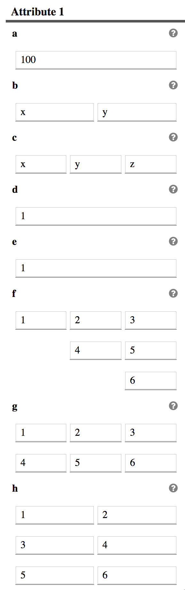
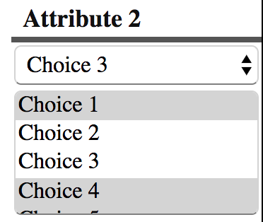
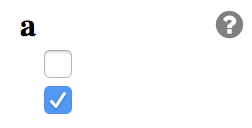
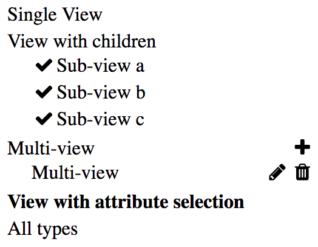

title: Model definition
---

<style>
center.half > img {
  width: 50%;
}
</style>

SimPut works around a model definition that the user have to define initially. The model is used to describe what kind of input are needed from the user and how those input should be layout via views.

## Format

The model can either be a JSON or a JavaScript file. We recommend using the JavaScript syntax as it will allow you to use comments and avoid other restrictions that JSON enforces.

```JavaScript
module.exports = {
  output: {},                                          // optional if no convert.js provided
  defaultActiveView: "NameOfTheViewInOrderToActivate", // Optional
  order: [],                                           // List view names in order for the menu
  views: {},                                           // Views definitions
  definitions: {},                                     // Attributes and parameters definitions
};
```

vs

```JSON
{
  "output": {},
  "defaultActiveView": "NameOfTheViewInOrderToActivate",
  "order": [],
  "views": {},
  "definitions": {}
}
```

## Model sections

Let's look closer to the various section that can exist inside a `model.[json/js]` file.

### Definitions

The definition is the home of the various attributes that regroup parameters that we want the user to input.
An attribute is defined by a group of parameters with a title.
Each parameter is listed in an order manner and provide the following set of fields:
- __id:__ Identifiant that is used inside the attribute map within the view model.
- __type:__ ['string', 'double', 'int', 'bool', ...] The type is to properly convert user input from standard UI to their actual type.
- __size:__ Provide how many values are required. -1 usually mean that the size is dynamic.
- __default:__ Provide a default / initial value
- __label *[option]*:__ User friendly label for the parameter name which can be provided within the /lang/ directory.

```
module.exports = {
  definitions: {
    attributeIdentifier: {
      label: 'User friendly string for the attribute section',
      parameters: [
        {
          id: 'firstname',
          type: 'string',
          size: 1,
          default: 'John',
          label: 'First Name',
        },
        {
          id: 'lastname',
          type: 'string',
          size: 1,
          default: 'Doe',
          label: 'Last Name',
        },
      ],
    },
  },
};
```

<center class="half">

Attribute rendering example
</center>

#### Parameter

##### Layout

When size is bigger than 1 it makes sense to start providing a layout hint. Below we list known layout hints.

```
"parameters": [
  {
     "id": "a",
     "type": "int",
     "size": 1,
     "default": 0
  },{
     "id": "b",
     "type": "string",
     "size": 2,
     "layout": "2",
     "default": ["x", "y"],
     "show": "a[0] > 5"
  },{
     "id": "c",
     "type": "string",
     "size": 3,
     "layout": "3",
     "default": ["x", "y", "z"]
  },{
     "id": "d",
     "type": "string",
     "size": 4,
     "default": [ "1", "2", "3", "4" ]
  },{
     "id": "e",
     "type": "string",
     "size": 5,
     "default": [ "1", "2", "3", "4", "5" ]
  },{
     "id": "f",
     "type": "string",
     "size": 6,
     "layout": "m6",
     "default": [ "1", "2", "3", "4", "5", "6" ]
  },{
     "id": "g",
     "type": "string",
     "size": 6,
     "layout": "2x3",
     "default": [ "1", "2", "3", "4", "5", "6" ]
  },{
     "id": "h",
     "type": "string",
     "size": 6,
     "layout": "3x2",
     "default": [ "1", "2", "3", "4", "5", "6" ]
  }
]
```

<center class="half">

Attribute rendering example
</center>

##### Show

An additional field can be provided to dynamically show or hide a given parameter based on a neighbor's value.
The value set is always captured within an array, which force the expression to be extracted like shown below.

```
"parameters": [
  {
     "id": "a",
     "type": "int",
     "size": 1,
     "default": 0
  },{
     "id": "b",
     "type": "string",
     "size": 2,
     "layout": "2",
     "default": ["x", "y"],
     "show": "a[0] > 5"
  }
]
```

##### UI

Sometimes a single field needs to have a custom presentation. A `ui` field is then used to let the user control what *presentation layer* should be used. Below are some existing `ui` implementations:

```
"attr2": {
  "parameters": [
     {
        "id": "a",
        "type": "int",
        "size": 1,
        "ui": "enum",
        "default": [3],
        "domain": {
           "Choice 1": 0,
           "Choice 2": 1,
           "Choice 3": 2,
           "Choice 4": 3,
           "Choice 5": 4
        }
     },{
        "id": "b",
        "type": "int",
        "size": -1,
        "ui": "enum",
        "default": [0,3,4],
        "domain": {
           "Choice 1": 0,
           "Choice 2": 1,
           "Choice 3": 2,
           "Choice 4": 3,
           "Choice 5": 4
        }
     }
  ]
},
```


<center class="half">

Attribute rendering with different ui
</center>

```
{
   "id": "a",
   "type": "bool",
   "size": 2,
   "ui": "checkbox",
   "default": [ true, false ]
}
```

<center class="half">

Attribute rendering with different ui
</center>

The domain in the UI can be filled by some external data.

```
{
   id: 'fancy',
   propType: 'CustomWidget', // Can be registered dynamically from an external script
   domain: {
      external: 'fieldToEmbedInUIAsDomain',
      dynamic: true, // Optional and only needed if the UI section of that parameter can not be cached
   }
}
```

##### Conditional attributes

Parameters can be dynamically composed based on other attribute parameters and conditional expressions.

```
"attrOr": {
   "parameters": [
      {
         "id": "a",
         "type": "int",
         "size": 1,
         "ui": "enum",
         "default": [3],
         "domain": {
            "Choice 1": 1,
            "Choice 2": 2,
            "Choice 3": 3,
            "Choice 4": 4,
            "Choice 5": 5
         },
         "help": ["_self", "attr1", "attr2"]
      },
      [ "attr1", "attr2", "attr3"]
   ],
   "children": {
      "attr1": "attrOr.a[0] >= 1",
      "attr2": "attrOr.a[0] === 2",
      "attr3": "attrOr.a[0] === 3"
   }
},
```

### Views

Views are meant to gather several attributes/parameters into meaningful pages that get driven based on a side menu.
The label for a view is what will be displayed in the side menu for selecting a given view/page.
The content of the page will be defined by the __attributes__ array content that was describe above.
Instead of __attributes__, a __children__ array can be used to create a nested list of other views.
A __size: -1__ is used for a view when you want to dynamically create/delete views in a list.

```
views : {
   SingleView: {
      label: 'Single View',
      attributes: [ 'attr1' ]
   },
   ViewWithChildren: {
      label: 'View with children',
      children: [ 'SubView1', 'SubView2', 'SubView3' ]
   },
   MultiView: {
      label: 'Multi-view',
      size: -1,
      attributes: [ 'attr1' ]
   },
   ViewWithOr: {
      attributes: [ 'attrOr' ]
   },
   SubView1: {...},
   SubView2: {...},
   SubView3: {...},
},
```


<center class="half">

View menu
</center>

Hooks can be attached to a view to dynamically massage the data between transitions. This allows, for instance, copying the dynamic view name into a parameter of a given attribute or exposing a set of view data into some external domain so they can be used somewhere else in the input definition.

```
views : {
   SingleView: {
      label: 'Single View',
      attributes: [ 'attr1' ],
      hooks: [
        // { type: 'copyViewNameToAttributeParameter', attribute: 'attributeName.parameterId' }, // Type available by default
        { type: 'copyParameterToViewName', attribute: 'attributeName.parameterId' },          // Type available by default
        { type: 'yourCustomHook', ...what-ever-you-want... },                                 // User defined hook dynamically registered
      ],
      readOnly: true,
   },
},
```

Note the `readOnly` option disables the view name editing in the side menu which works well if you want to use a parameter to define that view name.
The `noDelete` option disables the delete action on the view. That flag can either be defined in the view definition or inside the `currentViewData` that the hooks are getting passed. The 'readOnly' flag follows the same pattern regarding where its definition can be provided.

To register your own hooks, you will have to create a `hooks.js` next to your model file. The following listing illustrates what that file should look like.

```
function getExternal(dataModel) {
  if (!dataModel.external) {
    dataModel.external = {};
  }
  return dataModel.external;
}

function pushMaterialsToExternalHook(hookConfig, dataModel, currentViewData, modelDefinition) {
  const external = getExternal(dataModel);

  // Fill materials
  if (dataModel.data.Materials) {
    const mats = dataModel.data.Materials;
    external.materials = {};
    for (let i = 0; i < mats.length; i++) {
      const name = mats[i].name;
      const currentMaterial = { name };
      // Gather material fields
      Object.keys(mats[i].material).forEach((key) => {
        currentMaterial[key] = mats[i].material[key].value[0];
      });

      // save to external
      external.materials[name] = currentMaterial;
    }
  }
}

function paramToViewName(hookConfig, dataModel, currentViewData) {
  const [attributeName, parameterId] = hookConfig.attribute.split('.');
  currentViewData.name = currentViewData[attributeName][parameterId].value[0];
}

module.exports = function initialize() {
  Simput.registerHook('materialsToExternal', pushMaterialsToExternalHook);
  Simput.registerHook('paramToViewName', paramToViewName);
};

```

Hooks can also be used to alter the model definition in order to add or remove views in the __order__ list.

### Order

The __order__ list is used to define the side menu, providing the list of views in order. A view will not appear unless it is included in this list.

```
order: [
   'SingleView',
   'ViewWithChildren',
   'MultiView',
   'ViewWithOr',
   'AllTypes',
],
```

### Output

When a `convert.js` is not provided, additional information can be provided to define what should be generated as output based on the currently defined data model.

```
output: {
  'data.json': { type: 'default' },
  'other.xml': { type: 'template', template: './templates/vera-xml.hbs' },
},
```

Currently 2 types are available [__default__ or __template__]:
- The __default__ mode is just going to serialize the data model into JSON.
- The __template__ mode allow the user to define a [*Handlebars*](https://handlebarsjs.com/block_helpers.html) template to convert the JSON structure into any other format.

The output section requires an additional __output__ field inside each `view` definition.

#### Output inside views

On a view which lists a set of *attributes*, you will need to define an __output__ array that defines a mapping between view attributes and the output data model.

Here is an example:

```
output: [
  {
    extract: ['name', 'density', 'thexp', 'fractions'],
    src: 'material',
    dst: [
      'CASEID.CORE.Materials.Material_{name}.name=name',
      'CASEID.CORE.Materials.Material_{name}.density=density',
      'CASEID.CORE.Materials.Material_{name}.thexp=thexp',
      'CASEID.CORE.Materials.Material_{name}.fractions=fractions',
    ],
  },
],
```


Each entry in that output array should be composed of:
- __extract:__ list the parameters that we want to output somewhere in the model.
- __src:__ Name of the attribute that we want to extract the parameters from
- __dst:__ List of mapping of where to store the given parameters

The left side of the *dst* entry define the path where the parameter on the right side of the `=`should be stored.

When we want to fill an array with objects the following pattern can be used:

```
'root.elements[]+=name',
'root.elements.{name}.name=name',
'root.elements.{name}.density=density',
'root.elements.{name}.thexp=thexp',
'root.elements.{name}.fractions=fractions',
```


The `.` on the left side define the nesting structure inside an object.
The `{xxx}` are automatically replaced on the left side with the actual value of the `xxx` parameter.

### Scripts

External scripts can be loaded for a given type by providing at the root level a `scripts: [],` section with the list of url that the type should load.
This can be useful to register custom widgets to edit your custom parameters.
