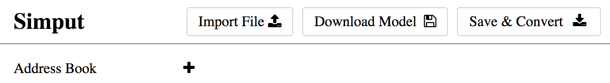
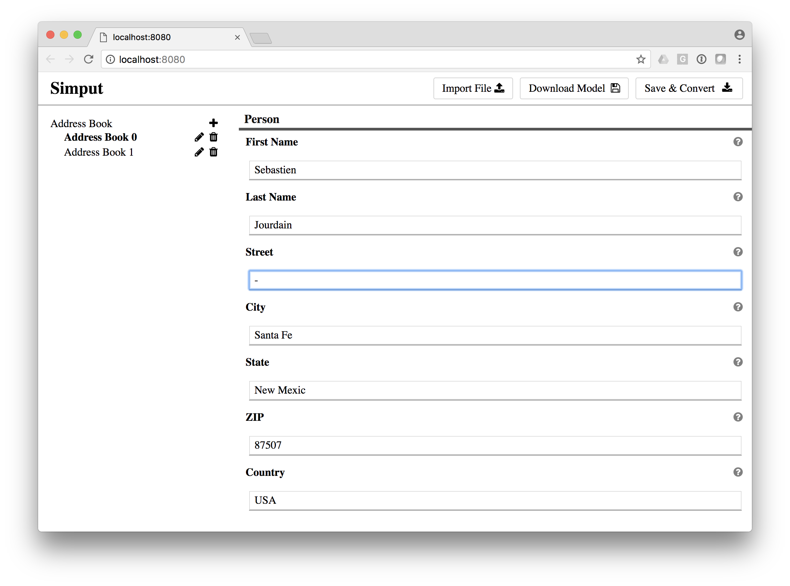
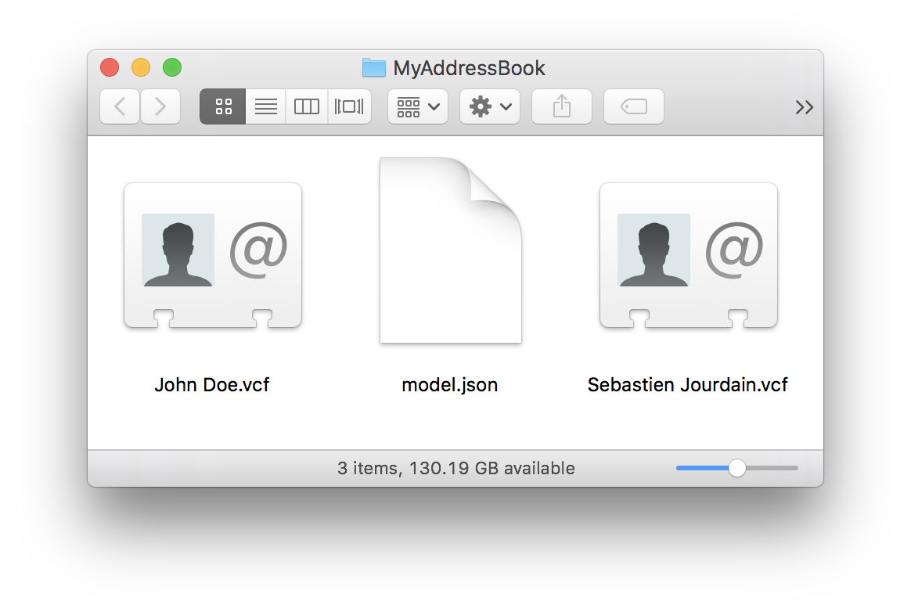

title: How to create an address book
---

<style>
center.half > img {
  width: 50%;
}
</style>

In that example we will use simput to create vcard for our contact information and we will walk you through the model definition to its usage inside Simput.

## Creation of new type

### Model creation

Let's create one View for which we can add and remove as many `person`. A `person` should have a __firstName__, __lastName__ with some *address* information.

```model.js
module.exports = {
   order: [
      'AddressBook'
   ],
   views : {
      AddressBook : { 
         id: 'AdressBook',  
         label : 'Address Book',   
         attributes: [ 'person' ],
         size: -1
      }
   },
   definitions: {
      person: {
         label: 'Person', 
         parameters: [
            {
               id     : 'firstName',
               label  : 'First Name',
               type   : 'string',
               size   : 1,
               default: 'John',
            },{
               id     : 'lastName',
               label  : 'Last Name',
               type   : 'string',
               size   : 1,
               default: 'Doe',
            },{
               id     : 'street',
               label  : 'Street',
               type   : 'string',
               size   : 1,
               default: 'No where to be found',
            },{
               id     : 'city',
               label  : 'City',
               type   : 'string',
               size   : 1,
               default: 'No Where',
            },{
               id     : 'state',
               label  : 'State',
               type   : 'string',
               size   : 1,
               default: 'ZZ',
            },{
               id     : 'zip',
               label  : 'ZIP',
               type   : 'string',
               size   : 1,
               default: '12345',
            },{
               id     : 'country',
               label  : 'Country',
               type   : 'string',
               size   : 1,
               default: 'Heaven',
            }
         ]
      }
   }
};
```

### Convert function

Now that we have the piece of information we want from the user, let's see how we can write each `person` into a single file with its personal information using the `vcard` format.

The funtion below will loop over each view data and will define a new file using a template that will allow us to respect the vcard format.

```convert.js
const vCardTemplate = require("./templates/vcard.hbs");

module.exports = function(dataModel) {
    const results = {};

    dataModel.data.AddressBook.forEach((attributes) => {
        const person = {};
        Object.keys(attributes.person).forEach((fieldName) => {
            person[fieldName] = attributes.person[fieldName].value[0];
        })
        results[`${person.firstName} ${person.lastName}.vcf`] = vCardTemplate(
            person
        );
    });

    return { results, model: dataModel };
};
```

### Template file

The following template is strait forward but looping and condition could be achieved inside a template. 
[Click to learn more about Handlebars](https://handlebarsjs.com/)

```templates/vcard.hbs
BEGIN:VCARD
VERSION:3.0
N:{{{lastName}}};{{{firstName}}};;;
FN:{{{firstName}}} {{{lastName}}}
ADR;type=HOME;type=pref:;;{{{street}}};{{{city}}};{{{state}}};{{{zip}}};{{{country}}}
END:VCARD
```

## Compilation of new type

Make sure `Simput` has been installed globally by running the following command line:

```
$ npm install -g simput
```

If properly installed, you should be able to run `Simput` and get the following command line help.

```
$ Simput 

  Usage: Simput [options]

  Options:

    -V, --version                 output the version number
    -i, --input [file|directory]  Input file or directory
    -o, --output [directory]      Output directory to output to
    -t, --type [type]             Type of input
    
    -n, --no-gui                  Just generate output
    -s, --silent                  Do not open the browser
    -p, --port [8080]             Server port
     (default: 8080)
    -c, --compile [directory]     Directory to compile files
    -m, --minify                  Minify compiled file
    -a, --add [file]              Add model to list of available inputs
    -l, --list                    List model types of available as inputs
    -r, --remove [type]           Remove model from list of available inputs
    -h, --help                    output usage information
```


Now, you should be able to build your new type define with the following file structure:

```
$ find . -type f
./convert.js
./templates/vcard.hbs
./model.js
```

Let's create a new compiled type `vcard` using the local directory for both input and output.

```
$ Simput -c . -o . -t vcard
```

Now let's see what we have

```
$ find . -type f
./convert.js
./vcard.js            # <---- New file
./templates/vcard.hbs
./model.js
```

Since we have new file, let's register that type into Simput by running the following command line:

```
$ Simput -a ./vcard.js
Added "vcard.js" to types

$ Simput -l
______________________
---- Simput Types ----
¯¯¯¯¯¯¯¯¯¯¯¯¯¯¯¯¯¯¯¯¯¯
 - vcard  : 

```

## Use Simput and your type to fill your address book

Let's try to run it and enter a couple of persons

```
$ Simput -t vcard -o ~/MyAddressBook
No valid json found in ~/MyAddressBook
Simput listening on port 8080
```

Open http://localhost:8080 in your browser.

<center class="half">

Initial empty page / content
</center>

Start filling it...

<center class="half">

Add a couple persons
</center>

Then press on `Save & Convert` button

<center class="half">

The vcard have been written along with the data model
</center>

If you restart Simput with the following command line, you will find all the persons you've entered

```
$ Simput -t vcard -o ~/MyAddressBook
Simput listening on port 8080
```

<center class="half">

Add a couple persons
</center>

